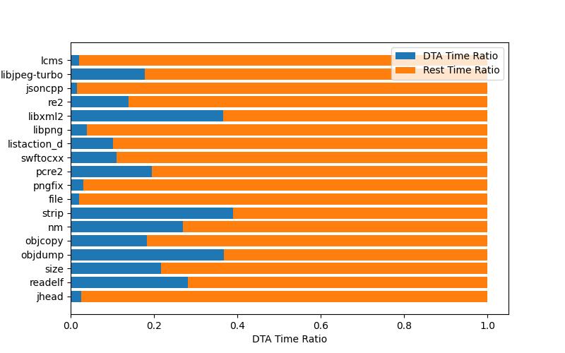

# DTA time
We further investigate the taint-analysis time in our fuzzing campaign as presented in the following figure, where it ranges from 1745 to 33589 seconds averagely during 24-hour runs. Notably, even though it costs 33589 seconds for taint analysis on project \codeIn{strip},  *MirageFuzz* still achieves the best edge coverage (i.e., covering 9417 edges) averagely in 24-hour run. 


# Unique Edges
Due to the large scale of our evaluation, involving 18 benchmarks and 10 fuzzers, 
it is hard to present the unique edges of each (fuzzer, benchmark) pair in a single Wayne diagram.

Therefore, we present the total unique edges of each fuzzer in the following table.
| Fuzzer | Unique Edges |
| :---: | :---: |
| $\text{MirageFuzz}$ | 4268 |
| $\text{AFL}$ | 7 |
| $\text{AFL++}$ | 277 |
| $\text{MOpt}$ | 299 |
| $\text{FairFuzz}$ | 22 |
| $\text{QSYM}$ | 1608 |
| $\text{Laf}$-Intel | 54 |
| $\text{Angora}$ | 2632 |
| $\text{MEUZZ}$ | 342 |
| $\text{Havoc}_\text{MAB}$ | 784 |  

# Benchmarks
The statistics of benchmarks is listed in our paper.

# Bugs found by *MirageFuzz* and corresponding calling stack or analysis

We list all the bugs as follows. Note that some bugs can only be triggered by MemorySanitizer/AddressSanitizer, which are already integrated in clang/gcc.

All the seeds that triggering bugs and the versions of the buggy programs could be found in the relevant **issue**.
## pcre2
### Infinite loop [issue](https://github.com/PCRE2Project/pcre2/issues/141)
For the while condition `needlen >= dbf_size` and the loop body `dbf_size *= 2`, 
we analyze that the value of `needlen`  potentially incurs infinite looping due to a possible integer overflow. 
In fact, one of our input files sets `i = -10`, which in turn assigns `needlen` with the value resulting in an infinite loop.
Correspondingly, the developers made a simple fix, i.e., patching `i-- == 0` as `i-- <= 0`. 

```
    int process_data(void) 
    {
        // ... 
        // p is a section from input file, li is s64, i is s32, needlen and dbuffer_size are u64.
        li = strtol((const char *)p, &endptr, 10);
        if (S32OVERFLOW(li)) { return OK; }
        i = (int32_t)li;
        if (i-- == 0) { return OK; }
        // ...
        replen = CAST8VAR(q) - start_rep;
        needlen += replen * i;
    
        if (needlen >= dbuffer_size)
        {
          // ...
          // where infinite loop happened.
          while (needlen >= dbuffer_size) 
              dbuffer_size *= 2;
          // ...
       }
       // ...
     }
```
## nm
### Infinite loop [issue](https://gcc.gnu.org/bugzilla/show_bug.cgi?id=106641#c0)
When parsing the unexpected symbol with the input seed file generated by MirageFuzz, `demangle_binder` incurs an infinite loop because the variable `bound_lifetimes` is parsed as an excessively huge number. Such number is then used as the iteration limit for the loop defined in line 9, causing the loop to be executed for unexpectedly massive times. 
```
1   static void
2   demangle_binder (struct rust_demangler *rdm)
3   {
4       uint64_t i, bound_lifetimes;
5       // ...
6       bound_lifetimes =
7           parse_opt_integer_62(rdm, 'G');
8       // ...
9       for (i = 0; i < bound_lifetimes; i++)
10      {
11          // ...
12          print_lifetime_from_index(rdm, 1);
13      }
14      // ...
15      }
16
```
```
#4  0x0000555555644036 in demangle_binder (rdm=0x7fffffffd9b0)
    at ./rust-demangle.c:662
#5  0x0000555555644f2c in demangle_type (rdm=0x7fffffffd9b0)
    at ./rust-demangle.c:956
#6  0x0000555555644dc4 in demangle_type (rdm=0x7fffffffd9b0)
    at ./rust-demangle.c:920
#7  0x00005555556445a6 in demangle_path (
    rdm=rdm@entry=0x7fffffffd9b0, in_value=in_value@entry=1)
    at ./rust-demangle.c:759
#8  0x00005555556456fd in demangle_path (in_value=1, 
    rdm=0x7fffffffd9b0) at ./rust-demangle.c:1482
#9  rust_demangle_callback (mangled=<optimized out>, 
    options=options@entry=259, 
    callback=callback@entry=0x555555645500 <str_buf_demangle_callback>, opaque=opaque@entry=0x7fffffffda20) at ./rust-demangle.c:1482
#10 0x000055555564590d in rust_demangle (mangled=<optimized out>, 
    options=options@entry=259) at ./rust-demangle.c:1593
#11 0x000055555563226f in cplus_demangle (
    mangled=mangled@entry=0x5555556a7cc5 "_RYOFGFF1FFFFFF_array_start", options=259, options@entry=3) at ./cplus-dem.c:166
#12 0x000055555558cfa3 in bfd_demangle (abfd=<optimized out>, 
    name=0x5555556a7cc5 "_RYOFGFF1FFFFFF_array_start", options=3)
    at bfd.c:2428
#13 0x00005555555827cb in print_symname (form=0x555555656c2c " %s", 
    info=0x7fffffffdb80, 
    name=0x5555556a7cc5 "_RYOFGFF1FFFFFF_array_start",
```
## jhead
### Use-of-uninitialized-value [issue](https://github.com/Matthias-Wandel/jhead/issues/53)
bug 1
```
    #0 0x42bddc in bcmp (./install/jhead/jhead-msan+0x42bddc)
    #1 0x4a1e49 in ReadJpegSections jpgfile.c:288:25
    #2 0x4a30d3 in ReadJpegFile jpgfile.c:384:11
    #3 0x499010 in ProcessFile jhead.c:914:10
    #4 0x497d7d in main jhead.c:1770:13
    #5 0x7fe59c2c2082 in __libc_start_main /build/glibc-SzIz7B/glibc-2.31/csu/../csu/libc-start.c:308:16
    #6 0x41bdfd in _start (./install/jhead/jhead-msan+0x41bdfd)
```
bug 2
```
    #0 0x42bddc in bcmp (./install/jhead/jhead-msan+0x42bddc)
    #1 0x4a1eb5 in ReadJpegSections jpgfile.c:294:31
    #2 0x4a30d3 in ReadJpegFile jpgfile.c:384:11
    #3 0x499010 in ProcessFile jhead.c:914:10
    #4 0x497d7d in main jhead.c:1770:13
    #5 0x7fba37ea5082 in __libc_start_main /build/glibc-SzIz7B/glibc-2.31/csu/../csu/libc-start.c:308:16
    #6 0x41bdfd in _start (./install/jhead/jhead-msan+0x41bdfd)
```
bug 3
```
    #0 0x4abfc9 in process_EXIF exif.c:1048:30
    #1 0x4a2697 in ReadJpegSections jpgfile.c:289:30
    #2 0x4a30d3 in ReadJpegFile jpgfile.c:384:11
    #3 0x499010 in ProcessFile jhead.c:914:10
    #4 0x497d7d in main jhead.c:1770:13
    #5 0x7f1ff4658082 in __libc_start_main /build/glibc-SzIz7B/glibc-2.31/csu/../csu/libc-start.c:308:16
    #6 0x41bdfd in _start (./install/jhead/jhead-msan+0x41bdfd)
```
## strip
### Out-of-memory [issue](https://sourceware.org/bugzilla/show_bug.cgi?id=29495)
By using the input generated by our approach, the execution on *strip* keeps consuming memory and causes an out-of-memory bug. In our evaluation, *strip* consumes 64 GiB memory in our server in about two minutes.

Similar to `malloc`, we found that `bfd_zalloc` is a function that allocates memory in the heap, located in the loop in line 18. The loop only terminates by updating `isec`, which is surrounded by a conditional code region from line 8 to line 12. Therefore, an out-of-memory bug can be triggered if *strip* fails to enter such code region, i.e., *strip* triggers an out-of-memory bug since the condition of such code region cannot be satisfied.
```
1   static bool rewrite_elf_program_header
2       (bfd *ibfd, bfd *obfd, bfd_vma maxpagesize)
3   {
4       // ...
5       isec = 0;
6       do {
7           // ...
8           if (IS_CONTAINED_BY_LMA(output_section,
        segment, map->p_paddr, opb) ||
9           IS_COREFILE_NOTE(segment, section)) {
10          // ...
11          ++isec;
12      }
13
14      // ...
15      if (isec < section_count) {
16          // ...
17          // bfd_zalloc allocates memory.
18          map = (struct elf_segment_map *)
        bfd_zalloc(obfd, amt);
19          // ...
20      }
21      continue;
22      } while (isec < section_count);
23      // ...
24  }
25
```


## pngfix
### Use-of-uninitialized-value [issue](https://github.com/glennrp/libpng/issues/424)
```
void png_read_start_row(png_structrp png_ptr) 
    {
          // ...
          // Where the uninitialized value reported by Memory sanitizer comes from png_ptr->big_row_buf and png_ptr->big_prev_row.
          if (png_ptr->interlaced != 0)
             png_ptr->big_row_buf = (png_bytep)
                png_calloc(png_ptr,row_bytes+48);
          else
             png_ptr->big_row_buf = (png_bytep)
                png_malloc(png_ptr,row_bytes+48);
          png_ptr->big_prev_row = (png_bytep)
             png_malloc(png_ptr,row_bytes+48);
          // ...
    }

```
```
==120623==WARNING: MemorySanitizer: use-of-uninitialized-value
    #0 0x7fa330a6a95d in png_read_filter_row_paeth_multibyte_pixel ./libpng/pngrutil.c:4079:11
    #1 0x7fa330a66254 in png_read_filter_row ./libpng/pngrutil.c:4140:7
    #2 0x7fa330a15371 in png_read_row ./libpng/pngread.c:548:10
    #3 0x49847d in read_png ./libpng/contrib/tools/pngfix.c:3636:15
    #4 0x496302 in one_file ./libpng/contrib/tools/pngfix.c:3667:12
    #5 0x496302 in main ./libpng/contrib/tools/pngfix.c:4009:16
    #6 0x7fa33043b082 in __libc_start_main /build/glibc-SzIz7B/glibc-2.31/csu/../csu/libc-start.c:308:16
    #7 0x41c2cd in _start (./install/libpng/install-msan/bin/pngfix+0x41c2cd)

SUMMARY: MemorySanitizer: use-of-uninitialized-value ./libpng/pngrutil.c:4079:11 in png_read_filter_row_paeth_multibyte_pixel 
```
### Infinite loop [issue](https://github.com/glennrp/libpng/issues/426)
```
png_uint_32 /* PRIVATE */
png_read_chunk_header(png_structrp png_ptr)
{
   png_byte buf[8];
   png_uint_32 length;

   // ... 
   // Where the infinite loop happened
   png_read_data(png_ptr, buf, 8);
   length = png_get_uint_31(png_ptr, buf); 

   // ...
   return length;
}
```
## listaction_d
### Segmentation fault [issue](https://github.com/libming/libming/issues/243)
bug 1
```
    #0 0x505673 in getName ./libming/util/decompile.c:424:15
    #1 0x4f1f25 in decompileRETURN ./libming/util/decompile.c:1921:3
    #2 0x4dfe26 in decompileAction ./libming/util/decompile.c
    #3 0x504dac in decompileActions ./libming/util/decompile.c:3535:6
    #4 0x504dac in decompile5Action ./libming/util/decompile.c:3558:2
    #5 0x4d3662 in outputSWF_DOACTION ./libming/util/outputtxt.c:1620:20
    #6 0x4da8a3 in readMovie ./libming/util/main.c:281:4
    #7 0x4da8a3 in main ./libming/util/main.c:354:2
    #8 0x7fd20f60f082 in __libc_start_main /build/glibc-SzIz7B/glibc-2.31/csu/../csu/libc-start.c:308:16
    #9 0x41c45d in _start (./libming/install-asan/bin/listaction_d+0x41c45d)
```
bug 2
```
    #0 0x4f04fa in decompileINCR_DECR ./libming/util/decompile.c:1640:65
    #1 0x4dcb41 in decompileAction ./libming/util/decompile.c:3359:10
    #2 0x504dac in decompileActions ./libming/util/decompile.c:3535:6
    #3 0x504dac in decompile5Action ./libming/util/decompile.c:3558:2
    #4 0x4d3662 in outputSWF_DOACTION ./libming/util/outputtxt.c:1620:20
    #5 0x4da8a3 in readMovie ./libming/util/main.c:281:4
    #6 0x4da8a3 in main ./libming/util/main.c:354:2
    #7 0x7fe1ef4cf082 in __libc_start_main /build/glibc-SzIz7B/glibc-2.31/csu/../csu/libc-start.c:308:16
    #8 0x41c45d in _start (./libming/install-asan/bin/listaction_d+0x41c45d)
```
bug 3
```
    #0 0x5058ec in getName ./libming/util/decompile.c:457:22
    #1 0x4f5d4a in decompileIF ./libming/util/decompile.c:2647:3
    #2 0x504dac in decompileActions ./libming/util/decompile.c:3535:6
    #3 0x504dac in decompile5Action ./libming/util/decompile.c:3558:2
    #4 0x4d3662 in outputSWF_DOACTION ./libming/util/outputtxt.c:1620:20
    #5 0x4da8a3 in readMovie ./libming/util/main.c:281:4
    #6 0x4da8a3 in main ./libming/util/main.c:354:2
    #7 0x7fcb308d5082 in __libc_start_main /build/glibc-SzIz7B/glibc-2.31/csu/../csu/libc-start.c:308:16
    #8 0x41c45d in _start (./libming/install-asan/bin/listaction_d+0x41c45d)
```
bug 4
```
    #0 0x50670c in getString ./libming/util/decompile.c:380:22
    #1 0x4ffc95 in decompileArithmeticOp ./libming/util/decompile.c
    #2 0x504dac in decompileActions ./libming/util/decompile.c:3535:6
    #3 0x504dac in decompile5Action ./libming/util/decompile.c:3558:2
    #4 0x4d3662 in outputSWF_DOACTION ./libming/util/outputtxt.c:1620:20
    #5 0x4da8a3 in readMovie ./libming/util/main.c:281:4
    #6 0x4da8a3 in main ./libming/util/main.c:354:2
    #7 0x7fd506872082 in __libc_start_main /build/glibc-SzIz7B/glibc-2.31/csu/../csu/libc-start.c:308:16
    #8 0x41c45d in _start (./libming/install-asan/bin/listaction_d+0x41c45d)
```
bug 5
```
    #0 0x5067bb in getString ./libming/util/decompile.c:391:22
    #1 0x50173a in decompileArithmeticOp ./libming/util/decompile.c
    #2 0x504dac in decompileActions ./libming/util/decompile.c:3535:6
    #3 0x504dac in decompile5Action ./libming/util/decompile.c:3558:2
    #4 0x4d3662 in outputSWF_DOACTION ./libming/util/outputtxt.c:1620:20
    #5 0x4da8a3 in readMovie ./libming/util/main.c:281:4
    #6 0x4da8a3 in main ./libming/util/main.c:354:2
    #7 0x7efd4a5ca082 in __libc_start_main /build/glibc-SzIz7B/glibc-2.31/csu/../csu/libc-start.c:308:16
    #8 0x41c45d in _start (./libming/install-asan/bin/listaction_d+0x41c45d)
```
bug 6
```
    #0 0x50598c in getName ./libming/util/decompile.c:472:22
    #1 0x4e7aca in decompileDEFINELOCAL2 ./libming/util/decompile.c:2050:2
    #2 0x4e7aca in decompileAction ./libming/util/decompile.c:3352:3
    #3 0x504dac in decompileActions ./libming/util/decompile.c:3535:6
    #4 0x504dac in decompile5Action ./libming/util/decompile.c:3558:2
    #5 0x4d3662 in outputSWF_DOACTION ./libming/util/outputtxt.c:1620:20
    #6 0x4da8a3 in readMovie ./libming/util/main.c:281:4
    #7 0x4da8a3 in main ./libming/util/main.c:354:2
    #8 0x7f0b8c54a082 in __libc_start_main /build/glibc-SzIz7B/glibc-2.31/csu/../csu/libc-start.c:308:16
    #9 0x41c45d in _start (./libming/install-asan/bin/listaction_d+0x41c45d)
```
### heap-buffer-overflow [issue](https://github.com/libming/libming/issues/242)
bug 1
```
    #0 0x507129 in getString ./libming/util/decompile.c:380:22
    #1 0x4fec36 in decompileArithmeticOp ./libming/util/decompile.c
    #2 0x4f5feb in decompileActions ./libming/util/decompile.c:3535:6
    #3 0x4f5feb in decompileIF ./libming/util/decompile.c:2699:4
    #4 0x4f5feb in decompileActions ./libming/util/decompile.c:3535:6
    #5 0x4f5feb in decompileIF ./libming/util/decompile.c:2699:4
    #6 0x4f5feb in decompileActions ./libming/util/decompile.c:3535:6
    #7 0x4f5feb in decompileIF ./libming/util/decompile.c:2699:4
    #8 0x504dac in decompileActions ./libming/util/decompile.c:3535:6
    #9 0x504dac in decompile5Action ./libming/util/decompile.c:3558:2
    #10 0x4d3662 in outputSWF_DOACTION ./libming/util/outputtxt.c:1620:20
    #11 0x4da8a3 in readMovie ./libming/util/main.c:281:4
    #12 0x4da8a3 in main ./libming/util/main.c:354:2
    #13 0x7fc5199c8082 in __libc_start_main /build/glibc-SzIz7B/glibc-2.31/csu/../csu/libc-start.c:308:16
    #14 0x41c45d in _start (./libming/install-asan/bin/listaction_d+0x41c45d)
```
bug 2
```
    #0 0x50712e in getString ./libming/util/decompile.c:391:22
    #1 0x505312 in decompilePUSHPARAM ./libming/util/decompile.c:878:22
    #2 0x4e6eeb in decompileAction ./libming/util/decompile.c
    #3 0x504dac in decompileActions ./libming/util/decompile.c:3535:6
    #4 0x504dac in decompile5Action ./libming/util/decompile.c:3558:2
    #5 0x4d3662 in outputSWF_DOACTION ./libming/util/outputtxt.c:1620:20
    #6 0x4da8a3 in readMovie ./libming/util/main.c:281:4
    #7 0x4da8a3 in main ./libming/util/main.c:354:2
    #8 0x7fd2837bb082 in __libc_start_main /build/glibc-SzIz7B/glibc-2.31/csu/../csu/libc-start.c:308:16
    #9 0x41c45d in _start (./libming/install-asan/bin/listaction_d+0x41c45d)
```
bug 3
```
    #0 0x506084 in getName ./libming/util/decompile.c:457:22
    #1 0x4e7860 in decompileGETPROPERTY ./libming/util/decompile.c
    #2 0x4e7860 in decompileAction ./libming/util/decompile.c:3301:3
    #3 0x504dac in decompileActions ./libming/util/decompile.c:3535:6
    #4 0x504dac in decompile5Action ./libming/util/decompile.c:3558:2
    #5 0x4d3662 in outputSWF_DOACTION ./libming/util/outputtxt.c:1620:20
    #6 0x4da8a3 in readMovie ./libming/util/main.c:281:4
    #7 0x4da8a3 in main ./libming/util/main.c:354:2
    #8 0x7f85bcb75082 in __libc_start_main /build/glibc-SzIz7B/glibc-2.31/csu/../csu/libc-start.c:308:16
    #9 0x41c45d in _start (./libming/install-asan/bin/listaction_d+0x41c45d)
```
## swftocxx
### Segmentation fault [issue](https://github.com/libming/libming/issues/244)
bug 1
```
    #0 0x4fcce3 in getName ./libming/util/decompile.c:424:15
    #1 0x4e9595 in decompileRETURN ./libming/util/decompile.c:1921:3
    #2 0x4d7496 in decompileAction ./libming/util/decompile.c
    #3 0x4fc41c in decompileActions ./libming/util/decompile.c:3535:6
    #4 0x4fc41c in decompile5Action ./libming/util/decompile.c:3558:2
    #5 0x4c8d26 in outputSWF_DEFINEBUTTON2 ./libming/util/outputscript.c:932:2
    #6 0x4d1f13 in readMovie ./libming/util/main.c:281:4
    #7 0x4d1f13 in main ./libming/util/main.c:354:2
    #8 0x7f1159056082 in __libc_start_main /build/glibc-SzIz7B/glibc-2.31/csu/../csu/libc-start.c:308:16
    #9 0x41c48d in _start (./install-asan/bin/swftocxx+0x41c48d)
```
bug 2
```
    #0 0x4e7b6a in decompileINCR_DECR ./libming/util/decompile.c:1640:65
    #1 0x4d49d6 in decompileAction ./libming/util/decompile.c:3356:10
    #2 0x4ed65b in decompileActions ./libming/util/decompile.c:3535:6
    #3 0x4ed65b in decompileIF ./libming/util/decompile.c:2699:4
    #4 0x4ed65b in decompileActions ./libming/util/decompile.c:3535:6
    #5 0x4ed65b in decompileIF ./libming/util/decompile.c:2699:4
    #6 0x4ed65b in decompileActions ./libming/util/decompile.c:3535:6
    #7 0x4ed65b in decompileIF ./libming/util/decompile.c:2699:4
    #8 0x4ed65b in decompileActions ./libming/util/decompile.c:3535:6
    #9 0x4ed65b in decompileIF ./libming/util/decompile.c:2699:4
    #10 0x4fc41c in decompileActions ./libming/util/decompile.c:3535:6
    #11 0x4fc41c in decompile5Action ./libming/util/decompile.c:3558:2
    #12 0x4ce29f in outputSWF_DOACTION ./libming/util/outputscript.c:1552:29
    #13 0x4d1f13 in readMovie ./libming/util/main.c:281:4
    #14 0x4d1f13 in main ./libming/util/main.c:354:2
    #15 0x7fbd92048082 in __libc_start_main /build/glibc-SzIz7B/glibc-2.31/csu/../csu/libc-start.c:308:16
    #16 0x41c48d in _start (./install-asan/bin/swftocxx+0x41c48d)
```
bug 3
```
    #0 0x4fcf5c in getName ./libming/util/decompile.c:457:22
    #1 0x4ed3ba in decompileIF ./libming/util/decompile.c:2647:3
    #2 0x4effbc in decompileActions ./libming/util/decompile.c:3535:6
    #3 0x4effbc in decompile_SWITCH ./libming/util/decompile.c:2278:4
    // ...
    #56 0x4d1f13 in readMovie ./libming/util/main.c:281:4
    #57 0x4d1f13 in main ./libming/util/main.c:354:2
    #58 0x7f426a492082 in __libc_start_main /build/glibc-SzIz7B/glibc-2.31/csu/../csu/libc-start.c:308:16
    #59 0x41c48d in _start (./install-asan/bin/swftocxx+0x41c48d)
```
bug 4
```
    #0 0x4fdd7c in getString ./libming/util/decompile.c:380:22
    #1 0x4f8d9f in decompileArithmeticOp ./libming/util/decompile.c
    #2 0x4effbc in decompileActions ./libming/util/decompile.c:3535:6
    #3 0x4effbc in decompile_SWITCH ./libming/util/decompile.c:2278:4
    #4 0x4effbc in decompileIF ./libming/util/decompile.c:2637:6
    #5 0x4effbc in decompileActions ./libming/util/decompile.c:3535:6
    #6 0x4effbc in decompile_SWITCH ./libming/util/decompile.c:2278:4
    #7 0x4effbc in decompileIF ./libming/util/decompile.c:2637:6
    #8 0x4fc41c in decompileActions ./libming/util/decompile.c:3535:6
    #9 0x4fc41c in decompile5Action ./libming/util/decompile.c:3558:2
    #10 0x4c8d26 in outputSWF_DEFINEBUTTON2 ./libming/util/outputscript.c:932:2
    #11 0x4d1f13 in readMovie ./libming/util/main.c:281:4
    #12 0x4d1f13 in main ./libming/util/main.c:354:2
    #13 0x7f825e5f8082 in __libc_start_main /build/glibc-SzIz7B/glibc-2.31/csu/../csu/libc-start.c:308:16
    #14 0x41c48d in _start (./install-asan/bin/swftocxx+0x41c48d)
```
bug 5
```
    #0 0x4fde2b in getString ./libming/util/decompile.c:391:22
    #1 0x4f766f in decompileArithmeticOp ./libming/util/decompile.c
    #2 0x4effbc in decompileActions ./libming/util/decompile.c:3535:6
    #3 0x4effbc in decompile_SWITCH ./libming/util/decompile.c:2278:4
    #4 0x4effbc in decompileIF ./libming/util/decompile.c:2637:6
    #5 0x4effbc in decompileActions ./libming/util/decompile.c:3535:6
    #6 0x4effbc in decompile_SWITCH ./libming/util/decompile.c:2278:4
    #7 0x4effbc in decompileIF ./libming/util/decompile.c:2637:6
    #8 0x4fc41c in decompileActions ./libming/util/decompile.c:3535:6
    #9 0x4fc41c in decompile5Action ./libming/util/decompile.c:3558:2
    #10 0x4c8d26 in outputSWF_DEFINEBUTTON2 ./libming/util/outputscript.c:932:2
    #11 0x4d1f13 in readMovie ./libming/util/main.c:281:4
    #12 0x4d1f13 in main ./libming/util/main.c:354:2
    #13 0x7f6e45d59082 in __libc_start_main /build/glibc-SzIz7B/glibc-2.31/csu/../csu/libc-start.c:308:16
    #14 0x41c48d in _start (./install-asan/bin/swftocxx+0x41c48d)
```
### heap-buffer-overflow [issue](https://github.com/libming/libming/issues/245) 
bug 1
```
    #0 0x4f1c59 in decompileIF ./libming/util/decompile.c:2479:79
    #1 0x4effbc in decompileActions ./libming/util/decompile.c:3535:6
    #2 0x4effbc in decompile_SWITCH ./libming/util/decompile.c:2278:4
    #3 0x4effbc in decompileIF ./libming/util/decompile.c:2637:6
    #4 0x4effbc in decompileActions ./libming/util/decompile.c:3535:6
    #5 0x4effbc in decompile_SWITCH ./libming/util/decompile.c:2278:4
    #6 0x4effbc in decompileIF ./libming/util/decompile.c:2637:6
    #7 0x4ed65b in decompileActions ./libming/util/decompile.c:3535:6
    #8 0x4ed65b in decompileIF ./libming/util/decompile.c:2699:4
    #9 0x4effbc in decompileActions ./libming/util/decompile.c:3535:6
    #10 0x4effbc in decompile_SWITCH ./libming/util/decompile.c:2278:4
    #11 0x4effbc in decompileIF ./libming/util/decompile.c:2637:6
    #12 0x4effbc in decompileActions ./libming/util/decompile.c:3535:6
    #13 0x4effbc in decompile_SWITCH ./libming/util/decompile.c:2278:4
    #14 0x4effbc in decompileIF ./libming/util/decompile.c:2637:6
    #15 0x4fc41c in decompileActions ./libming/util/decompile.c:3535:6
    #16 0x4fc41c in decompile5Action ./libming/util/decompile.c:3558:2
    #17 0x4c8d26 in outputSWF_DEFINEBUTTON2 ./libming/util/outputscript.c:932:2
    #18 0x4d1f13 in readMovie ./libming/util/main.c:281:4
    #19 0x4d1f13 in main ./libming/util/main.c:354:2
    #20 0x7fc79ae82082 in __libc_start_main /build/glibc-SzIz7B/glibc-2.31/csu/../csu/libc-start.c:308:16
    #21 0x41c48d in _start (./install-asan/bin/swftocxx+0x41c48d)
```
but 2
```
    #0 0x4f201e in decompile_SWITCH ./libming/util/decompile.c:2265:51
    #1 0x4f201e in decompileIF ./libming/util/decompile.c:2637:6
    #2 0x4effbc in decompileActions ./libming/util/decompile.c:3535:6
    #3 0x4effbc in decompile_SWITCH ./libming/util/decompile.c:2278:4
    #4 0x4effbc in decompileIF ./libming/util/decompile.c:2637:6
    #5 0x4fc41c in decompileActions ./libming/util/decompile.c:3535:6
    #6 0x4fc41c in decompile5Action ./libming/util/decompile.c:3558:2
    #7 0x4c8d26 in outputSWF_DEFINEBUTTON2 ./libming/util/outputscript.c:932:2
    #8 0x4d1f13 in readMovie ./libming/util/main.c:281:4
    #9 0x4d1f13 in main ./libming/util/main.c:354:2
    #10 0x7f6009961082 in __libc_start_main /build/glibc-SzIz7B/glibc-2.31/csu/../csu/libc-start.c:308:16
    #11 0x41c48d in _start (./install-asan/bin/swftocxx+0x41c48d)
```
bug 3
```
    #0 0x4f1d89 in dcputchar ./libming/util/decompile.c:116:8
    #1 0x4f1d89 in decompileIF ./libming/util/decompile.c:2645:3
    #2 0x4effbc in decompileActions ./libming/util/decompile.c:3535:6
    #3 0x4effbc in decompile_SWITCH ./libming/util/decompile.c:2278:4
    // ...
    #119 0x4d1f13 in readMovie ./libming/util/main.c:281:4
    #120 0x4d1f13 in main ./libming/util/main.c:354:2
    #121 0x7fea92f22082 in __libc_start_main /build/glibc-SzIz7B/glibc-2.31/csu/../csu/libc-start.c:308:16
    #122 0x41c48d in _start (./install-asan/bin/swftocxx+0x41c48d)
```
bug 4
```
    #0 0x4fd751 in strcpyext ./libming/util/decompile.c:259:10
    #1 0x4fd751 in getName ./libming/util/decompile.c:435:11
    #2 0x4df840 in decompileIMPLEMENTS ./libming/util/decompile.c:3229:3
    #3 0x4df840 in decompileAction ./libming/util/decompile.c:3509:10
    #4 0x4fc41c in decompileActions ./libming/util/decompile.c:3535:6
    #5 0x4fc41c in decompile5Action ./libming/util/decompile.c:3558:2
    #6 0x4c8d26 in outputSWF_DEFINEBUTTON2 ./libming/util/outputscript.c:932:2
    #7 0x4d1f13 in readMovie ./libming/util/main.c:281:4
    #8 0x4d1f13 in main ./libming/util/main.c:354:2
    #9 0x7fe18d23b082 in __libc_start_main /build/glibc-SzIz7B/glibc-2.31/csu/../csu/libc-start.c:308:16
    #10 0x41c48d in _start (./install-asan/bin/swftocxx+0x41c48d)
```
### Allocation-size-too-big [issue](https://github.com/libming/libming/issues/246)
```
==229354==ERROR: AddressSanitizer: requested allocation size 0xffffffff8c01020f (0xffffffff8c011210 after adjustments for alignment, red zones etc.) exceeds maximum supported size of 0x10000000000 (thread T0)
==229354==WARNING: failed to fork (errno 12)
==229354==WARNING: failed to fork (errno 12)
==229354==WARNING: failed to fork (errno 12)
==229354==WARNING: failed to fork (errno 12)
==229354==WARNING: failed to fork (errno 12)
==229354==WARNING: Failed to use and restart external symbolizer!
    #0 0x494bcd  (./libming/install-asan/bin/swftocxx+0x494bcd)
    #1 0x4fec2c  (./libming/install-asan/bin/swftocxx+0x4fec2c)

==229354==HINT: if you don't care about these errors you may set allocator_may_return_null=1
SUMMARY: AddressSanitizer: allocation-size-too-big (./libming/install-asan/bin/swftocxx+0x494bcd) 
==229354==ABORTING
```
### Out-of-memory [issue](https://github.com/libming/libming/issues/247)
bug 1
```
==228662==ERROR: AddressSanitizer: allocator is out of memory trying to allocate 0x46008004 bytes
==228662==WARNING: failed to fork (errno 12)
==228662==WARNING: failed to fork (errno 12)
==228662==WARNING: failed to fork (errno 12)
==228662==WARNING: failed to fork (errno 12)
==228662==WARNING: failed to fork (errno 12)
==228662==WARNING: Failed to use and restart external symbolizer!
    #0 0x494bcd  (./libming/install-asan/bin/swftocxx+0x494bcd)
    #1 0x4fdc4e  (./libming/install-asan/bin/swftocxx+0x4fdc4e)
    #2 0x4fa943  (./libming/install-asan/bin/swftocxx+0x4fa943)

==228662==HINT: if you don't care about these errors you may set allocator_may_return_null=1
SUMMARY: AddressSanitizer: out-of-memory (./libming/install-asan/bin/swftocxx+0x494bcd) 
==228662==ABORTING
```
bug 2
```
==228380==ERROR: AddressSanitizer: allocator is out of memory trying to allocate 0xe6b9c30 bytes
==228380==WARNING: failed to fork (errno 12)
==228380==WARNING: failed to fork (errno 12)
==228380==WARNING: failed to fork (errno 12)
==228380==WARNING: failed to fork (errno 12)
==228380==WARNING: failed to fork (errno 12)
==228380==WARNING: Failed to use and restart external symbolizer!
    #0 0x494d42  (./libming/install-asan/bin/swftocxx+0x494d42)
    #1 0x4ecd87  (./libming/install-asan/bin/swftocxx+0x4ecd87)

==228380==HINT: if you don't care about these errors you may set allocator_may_return_null=1
SUMMARY: AddressSanitizer: out-of-memory (./libming/install-asan/bin/swftocxx+0x494d42) 
==228380==ABORTING
```
